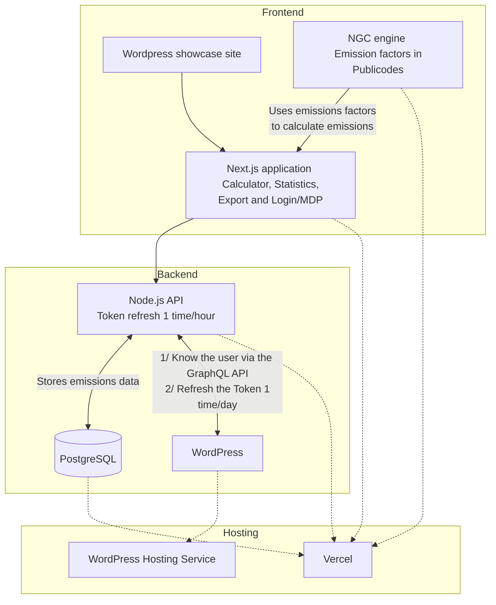

```mermaid
graph TD

subgraph "Frontend"
WordpressVitrine[Wordpress showcase site]
NextJS[Next.js application \n Calculator, Statistics, Export and Login/MDP]
NGC[NGC engine \n Emission factors in Publicodes ]

end

subgraph "Backend"
WordPress[WordPress]
NodeAPI[Node.js API \n Token refresh 1 time/hour]
BDD[(PostgreSQL)]
end

subgraph "Hosting"
Vercel
WP_Hosting[WordPress Hosting Service]
end

WordpressVitrine --> NextJS

NextJS --> NodeAPI

NodeAPI <-->|Stores emissions data| BDD
NGC -->|Uses emissions factors \nto calculate emissions| NextJS
NodeAPI <-->|1/ Know the user via the GraphQL API\n 2/ Refresh the Token 1 time/day| WordPress

NextJS -.-> Vercel
NodeAPI -.-> Vercel
NGC -.-> Vercel
WordPress -.-> WP_Hosting
BDD -.-> Vercel
```
