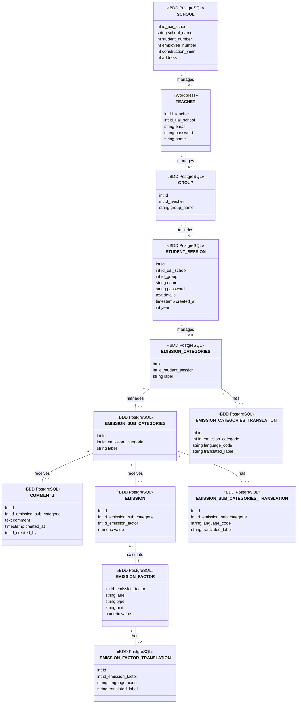

```mermaid
classDiagram

    class SCHOOL {
        <<BDD PostgreSQL>>
        int id_uai_school
        string school_name
        int student_number
        int employee_number
        int construction_year
        int address
    }

    class TEACHER {
        <<Wordpress>>
        int id_teacher
        int id_uai_school
        string email
        string password
        string name
    }

    class STUDENT_SESSION {
        <<BDD PostgreSQL>>
        int id
        int id_uai_school
        int id_group
        string name
        string password
        text details
        timestamp created_at
        int year
    }

    class GROUP {
        <<BDD PostgreSQL>>
        int id
        int id_teacher
        string group_name
    }

    class EMISSION_CATEGORIES {
        <<BDD PostgreSQL>>
        int id
        int id_student_session
        string label
    }

    class EMISSION_SUB_CATEGORIES {
        <<BDD PostgreSQL>>
        int id
        int id_emission_categorie
        string label
    }

    class COMMENTS {
        <<BDD PostgreSQL>>
        int id
        int id_emission_sub_categorie
        text comment
        timestamp created_at
        int id_created_by
    }

    class EMISSION {
        <<BDD PostgreSQL>>
        int id
        int id_emission_sub_categorie
        int id_emission_factor
        numeric value
    }

    class EMISSION_FACTOR {
        <<BDD PostgreSQL>>
        int id_emission_factor
        string label
        string type
        string unit
        numeric value
    }

    class EMISSION_FACTOR_TRANSLATION {
        <<BDD PostgreSQL>>
        int id
        int id_emission_factor
        string language_code
        string translated_label
    }

       class EMISSION_CATEGORIES_TRANSLATION {
        <<BDD PostgreSQL>>
        int id
        int id_emission_categorie
        string language_code
        string translated_label
    }

       class EMISSION_SUB_CATEGORIES_TRANSLATION {
        <<BDD PostgreSQL>>
        int id
        int id_emission_sub_categorie
        string language_code
        string translated_label
    }

    TEACHER "1" -- "0..*" GROUP : manages
    SCHOOL "1" -- "0..*" TEACHER : manages
    STUDENT_SESSION "1" -- "0..5" EMISSION_CATEGORIES : manages
    GROUP "1" -- "0..*" STUDENT_SESSION : includes
    EMISSION_CATEGORIES "1" -- "0..*" EMISSION_SUB_CATEGORIES : manages
    EMISSION_SUB_CATEGORIES "1" -- "0..*" COMMENTS : receives
    EMISSION_SUB_CATEGORIES "1" -- "0..*" EMISSION : receives
    EMISSION "0..*" -- "1" EMISSION_FACTOR : calculate
    EMISSION_FACTOR "1" -- "0..*" EMISSION_FACTOR_TRANSLATION : has
    EMISSION_SUB_CATEGORIES "1" -- "0..*" EMISSION_SUB_CATEGORIES_TRANSLATION : has
    EMISSION_CATEGORIES "1" -- "0..*" EMISSION_CATEGORIES_TRANSLATION : has
```
